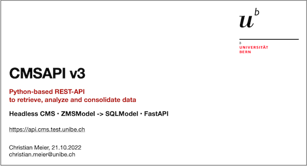

# CMSAPI

Python-based REST API for retrieving, analyzing and consolidating content published in UniBE CMS and other information systems.

!!! info "OpenAPI Docs"

    - v3 generated by [Swagger](/v3/swagger) / [ReDoc](/v3/redoc)
    - v2 generated by [Swagger](/v2/) *(deprecated)*

## Overview

The implementation of a RESTful API for UniBE CMS relies on the [FastAPI](https://fastapi.tiangolo.com) Library. This should enable a more lightweight Python development mode alongside the historically grown [Zope](https://github.com/zopefoundation/Zope) stack[^1].

Additionally, CMSAPI makes use of [SQLModel](https://sqlmodel.tiangolo.com) to implement the object relational mapping, [Typer](https://typer.tiangolo.com) for the CLI admin tool, and is served by [Uvicorn](https://www.uvicorn.org) in testing and production deployments.

This [presentation (see pdf)](img/CMSAPI-v3.pdf) gives an overview of the background and objectives:

 

## Objectives

The CMSAPI serves to decouple the established and solid backend content management system ZMS from frontend [web development](https://web.dev/learn/) (Single-page apps, Progressive web apps, Mobile apps native, hybrid, etc.), which is nowadays extremely volatile compared to the backend.

JavaScript-based frontend technologies are a highly dynamic environment with exciting hype cycles of constant rise and fall — naming [Angular](https://angular.io), [React](https://reactjs.org), [Vue](https://vuejs.org) or [Svelte](https://svelte.dev).

The same applies to native app development with Swift, Objective-C, Java, Kotlin for the mobile operating systems iOS and Android or SDKs such as [Flutter](https://flutter.dev/) using Dart programming language for the development of cross-platform apps.

!!! note "Decouple frontend from backend development"

    Basically, the over decades proven mechanisms of the backend **CMS Template Engine[^2]** should be _"preserved"_ from _"overwhelming"_ frontend logic.

    On the other hand, the possibilities of current frontend JavaScript Frameworks for content presentation should be opened up, e.g. for **Scrollytelling[^3]**.

## Implementation

To achieve decoupling, the development of a **headless mode for ZMS** was started (internal branch `zms-headless`)[^4].

This allows direct access to content objects stored in ZODB without the need to run a Zope Application server in context of CMSAPI — the corresponding Zope Python packages are needed only for database connection and data deserialization.

This architecture provides a decoupled work on the interface, so the **CMSAPI can be developed and deployed independently** of running ZMS backend system(s). Thus, additional Python libraries and language features can be used easily and flexibly – no matter if they are present or not in the existing ZMS backend system.

See the [Examples](examples.md) and the interactive [OpenAPI docs](/v3/swagger).

!!! info

    Up to v2, the CMSAPI is based on the [Flask framework](https://flask.palletsprojects.com) with (confusing) extension modules for REST implementation as well as ZODB connectivity. 
    
    The v3 is a new implementation based on [FastAPI](https://fastapi.tiangolo.com), which also includes an object relation mapping of ZMSModels. Using the command line tool `cmsapi.admin`, data from the ZODB can be stored in a PostgreSQL database for high performance querying (including offset/limit for pagination, order/group by, joins, etc.) and can be combined with data from other data sources (e.g. to aggregate [News/Events](newsevents-api-draft.md) from other systems).

## Next steps / ideas

The whole approach can also be used to **move specific logic from the backend to the interface**

* for data searching and filtering using SQL or [GraphQL](https://graphql.org/) queries,
* for connections to third-party service providers like [OpenSearch](https://opensearch.org/) engine,
* for asynchronous and distributed processing with [Message brokers](https://en.wikipedia.org/wiki/Message_broker) — see also [AsyncAPI](https://www.asyncapi.com) for such event-driven architectures.

Responses of data queries and/or transformations could be re-integrated back into the ZMI — the user interface of the ZMS backend can be seen as a specific frontend web app that receives and sends messages from/to the CMSAPI using [WebSockets](https://developer.mozilla.org/en-US/docs/Web/API/WebSockets_API).

!!! note "Further reading"

    === "Guides/Tutorials"
    
        * [FastAPI WebSockets](https://fastapi.tiangolo.com/advanced/websockets/)
        * [FastAPI Background Tasks](https://fastapi.tiangolo.com/tutorial/background-tasks/)
        * [FastAPI Security](https://fastapi.tiangolo.com/advanced/security/)
        * [FastAPI Mount Sub Applications](https://fastapi.tiangolo.com/advanced/sub-applications/)
        * [FastAPI Links and Articles](https://fastapi.tiangolo.com/id/external-links/)

    === "Concepts/References"

        * [Contentful API basics](https://www.contentful.com/developers/docs/concepts/apis/)
        * [Contentful CMS as Code](https://www.contentful.com/help/cms-as-code/)
        * [Content Management API](https://www.contentful.com/developers/docs/references/content-management-api/)
        * [Content Delivery API](https://www.contentful.com/developers/docs/references/content-delivery-api/)
        * [Content Sync API](https://www.contentful.com/developers/docs/concepts/sync/)

    === "Contexts/Backgrounds"
        
        * [Nordic APIs Security blog](https://nordicapis.com/category/security/)
        * [How to Secure API Endpoints](https://nordicapis.com/how-to-secure-api-endpoints-9-tips-and-solutions/)
        * [What Is OAuth? A Breakdown for Beginners](https://nordicapis.com/oauth-a-breakdown-for-beginners/)
        * [OAuth Flows and Powers](https://nordicapis.com/8-types-of-oauth-flows-and-powers/)
        * [Deep Dive into OAuth and OpenID Connect](https://nordicapis.com/api-security-oauth-openid-connect-depth/)

!!! warning "Further development"
    
    Currently, the focus of CMSAPI is exclusively on retrieving public data and content from the ZODB.

    Write access to the ZODB would still need to be evaluated if required — as would the consideration of valid permissions to access the database ([ACLs](https://en.wikipedia.org/wiki/Access-control_list)).

    Further relevant topics include other **security concerns** ([OAuth](https://en.wikipedia.org/wiki/OAuth), [WAF](https://en.wikipedia.org/wiki/Web_application_firewall)) and how to **control the delivery** using caching, rate limits, etc.

[^1]: see [Zope Overview](https://zope.dev/world.html) and [Timeline](https://www.zope.de/history.html)

[^2]: see [Zope Page Templates (ZPT)](https://zope.readthedocs.io/en/latest/zopebook/AppendixC.html) using [Template Attribute Language (TAL)](https://en.wikipedia.org/wiki/Template_Attribute_Language)

[^3]: see [Pull request](https://github.com/idasm-unibe-ch/unibe-cms-frontend/pull/185) and [Discussion](https://github.com/idasm-unibe-ch/unibe-cms-frontend/discussions/184) for a Scrollytelling frontend web app based on Fetch API to retrieve content from ZMS backend 

[^4]: see [GitHub Enterprise Server](https://github.unibe.ch/idasm-unibe-ch/zms-core/tree/zms-headless) with interal repository at branch `zms-headless` (UniBE VPN and Campus Account needed)
